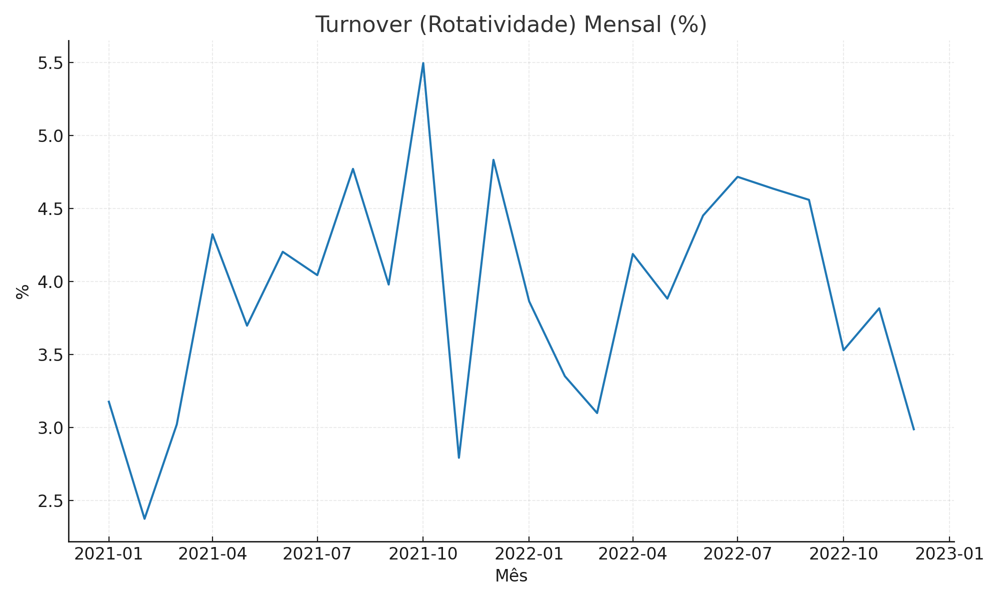
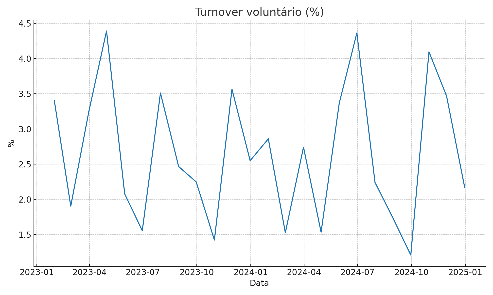
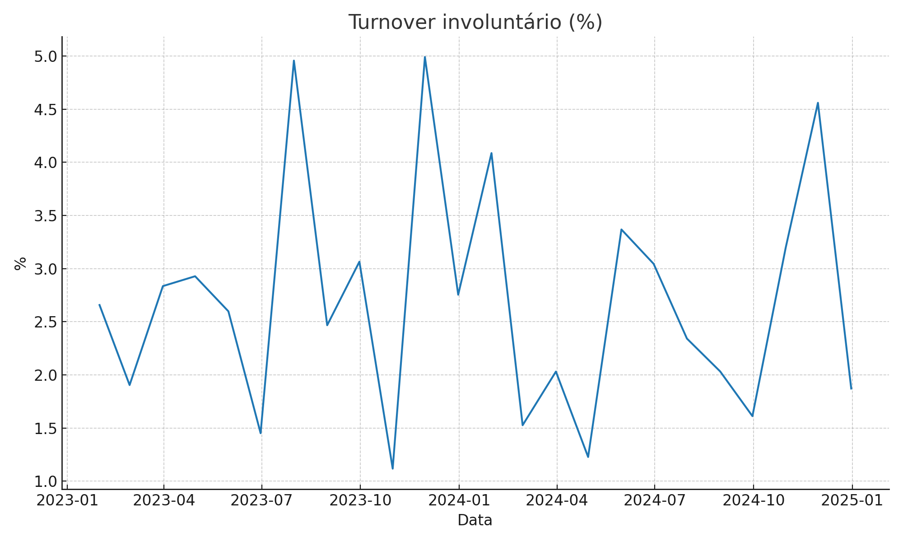
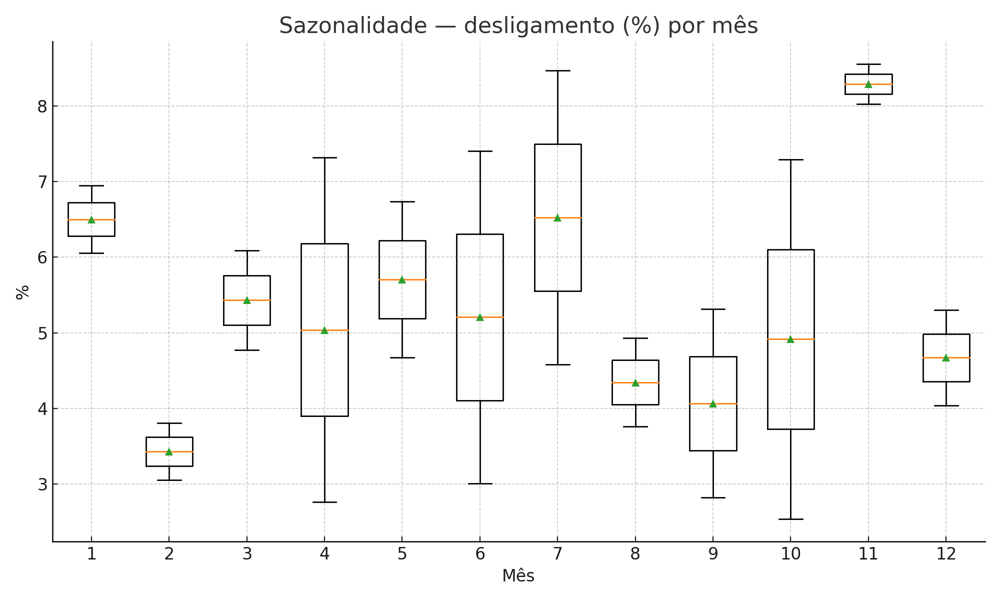
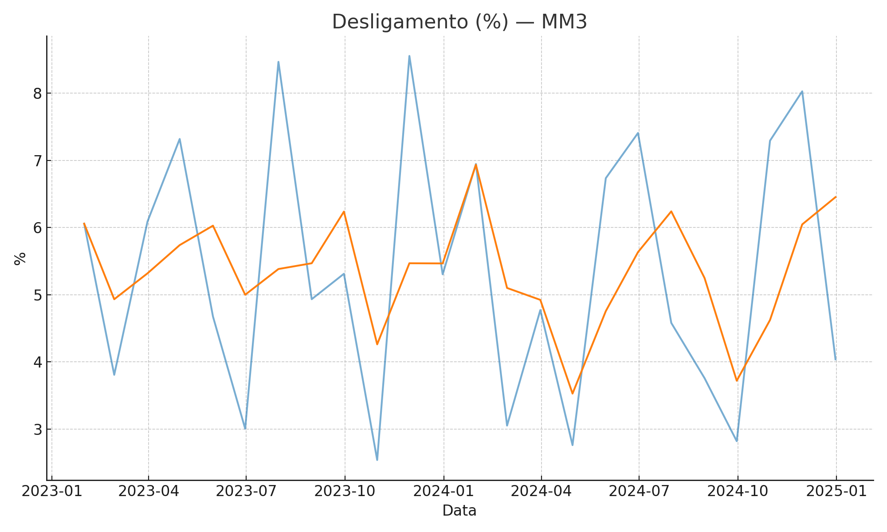
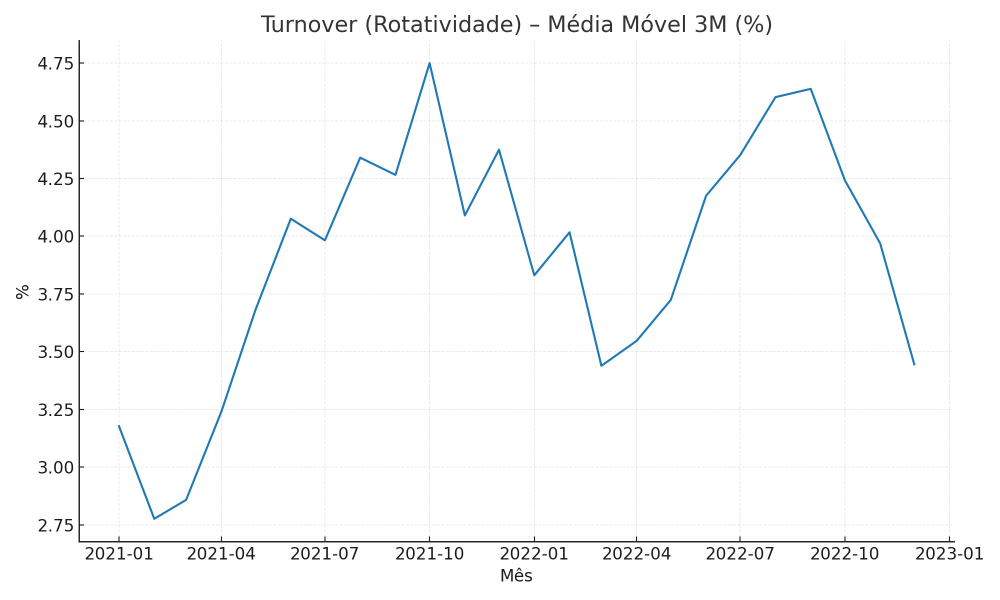

# Case Técnico — Coordenador de People Analytics
Autor: Mario L. O. Porto — Coordenador de People Analytics (case técnico)

Este repositório contém o material do case com **código Python testável**, **gráficos** e **relatórios**.  
Turnover calculado por: `[(Admissões + Desligamentos)/2] / Total HC * 100` (rotatividade) e **taxa de desligamento** separada (desligamentos / HC médio).

## Visão Geral

O objetivo foi diagnosticar a rotatividade de pessoal ao longo de 24 meses, propor alavancas de melhoria contínua e um projeto preditivo, e transformar isso em um plano de ação mensurável.

## Pilar 1 — Diagnóstico Estatístico (Exploratório)

### 1.1 Definições e Fórmulas

Para evitar ambiguidade entre turnover e taxa de desligamento, adotamos duas métricas centrais:

Turnover (Rotatividade, “ampliado”) = [(Admissões + Desligamentos) / 2] / Headcount total × 100
Racional: mede a pressão de movimentação de pessoas (entrada + saída) no período.

Taxa de Desligamento = Desligamentos / Headcount médio × 100
Racional: métrica clássica para comparar saídas entre áreas/empresas. Em muitas praças, é chamada de “turnover”.

Headcount médio do mês = média de Total_{t-1} e Total_t (no primeiro mês, usa-se Total_t).

Também abrimos a composição:

Voluntário = Desligamentos voluntários / HC médio × 100
Involuntário = Desligamentos involuntários / HC médio × 100

### 1.2 Estatísticas Descritivas (taxas mensais, em %)

(Ver aba Estatísticas do arquivo output/people-analytics-turnover.xlsx).

Resumo qualitativo:

Turnover (rotatividade): nível moderado, com variação sazonal em meses de pico de movimento (jun–out).
Desligamento: picos notáveis em out/2021, coerentes com a série; CV indica variação moderada.
Mix voluntário/involuntário: média aproximada de ~45% voluntário / ~55% involuntário no período.

### 1.3 Série Temporal, Tendência e Sazonalidade

Tendência: média móvel 3M mostra leve alta estrutural na taxa de desligamento em 2022 vs 2021.
Sazonalidade: média por mês indica picos entre jun–out; vales no início de ano (jan–fev).
(Ver output/seasonality_desligamento.png.)

### 1.4 Anomalias

Usamos z-score na taxa de desligamento. Marcamos como anomalia |z| ≥ 2.

Destaque: out/2021 (~6,34%) → z elevado, merece deep dive (motivos, áreas, gestores).
Exportadas em output/anomalias_desligamento.csv.

### 1.5 Hipóteses e Dados Faltantes

H1 (Voluntário): compa-ratio e eNPS baixos elevam pedidos de desligamento.

H2 (Involuntário): absenteísmo e performance baixa elevam desligamentos por decisão da empresa.

Dados a coletar para validação estatística: remuneração (faixa, compa-ratio), carreira (mobilidade, promoções), eNPS, tenure (tempo de casa), engajamento (pulse), horas extras, jornada, registros de performance/PDIs, motivo de saída padronizado, localização/turno/gestor/cargo/família de cargo.

## Pilar 2 — Melhoria Contínua (Lean Six Sigma — DMAIC)

Meta do projeto: reduzir turnover voluntário para ≤ 1,40%/mês em 6 meses, mantendo qualidade operacional e evitando deslocamento do problema (ex.: aumento indevido do involuntário).

### D — Define (Definir)

Problema: pico e variabilidade do voluntário em áreas X/Y geram perdas de produtividade e custos de reposição.
Escopo: áreas X/Y (piloto), população CLT, centros A/B; período base 12 meses.
KPI primário: Voluntário % (mensal); secundários: eNPS, taxa 0–90 dias, TTM de reposição, custo por desligamento.
Meta: ≤ 1,40%/mês nas áreas piloto, com IC95% comprovando redução.

### M — Measure (Medir)

Mapa de dados: HRIS, folha, ponto eletrônico, pesquisa de clima (eNPS), remuneração, desempenho.
Qualidade dos dados: data quality checks (missing, duplicidades, consistência temporal).
Linha de base: série 12–24 meses por área/gestor; p-charts para estabilidade do processo.

### A — Analyze (Analisar)

Drivers (hipóteses): desequilíbrio salarial (compa-ratio), baixa mobilidade interna, liderança local, sobrecarga/horas extras, jornada em turnos específicos.
Técnicas: regressões/árvores de decisão (voluntário ~ variáveis), Pareto de motivos de saída, time-to-event nos 0–180 dias.

### I — Improve (Melhorar)

Ações candidatas:
Stay interviews entre 60–120 dias e após 1 ano (checklist padronizado).
Janela de mobilidade interna trimestral + comunicação ativa de vagas.
Revisão de bandas salariais (áreas com compa-ratio < 0,95).
Limite de horas extras sustentado e redistribuição de carga.
Treinamento de liderança em 1:1, feedback e carreira.
Teste controlado: pilotos A/B por área, 8–12 semanas; KPIs com SPC (p-charts) e diff-in-diff quando aplicável.

### C — Control (Controlar)

Painel mensal (People Analytics) com alerts, p-charts, e drill-down por gestor/cargo.
Ritual de governança: ops review mensal (RH + negócio), playbook de retenção e runbook de reposição.
Padronização: atualizar políticas (mobilidade, bandas), OKRs e PIPs para casos de performance.

## Pilar 3 — Preditivo (Machine Learning)

Objetivo: estimar probabilidade de pedido de demissão em 90 dias (janela deslizante), priorizando ações de retenção.

### 3.1 Objetivo e Escopo (linguagem simples)
O que prever: quem tem maior chance de pedir demissão voluntária.

•	Janela: nos próximos 90 dias após cada referência mensal.

•	Unidade de análise: pessoa-mês (um score por colaborador por mês).

•	População: empregados ativos; excluímos quem acabou de entrar (ex.: <30 dias) para evitar ruído.

•	Frequência: mensal (após o fechamento do mês).

Por que assim? Alinha previsão com ciclos de RH e permite ações práticas (conversas, retenção, mobilidade).

### 3.2 Dados e Features (o que entra no modelo)

•	Demografia/contrato: área, cargo, unidade, turno, modo (presencial/remoto), tenure (tempo de casa).

•	Remuneração: salário, compa-ratio (salário vs. faixa), promoções/reajustes, PLR.

•	Jornada/absenteísmo: horas extras, faltas/atrasos.

•	Carreira: promoções, movimentações internas, cursos.

•	Clima/engajamento: eNPS, pesquisas pulse.

•	Desempenho: rating, PIP.

•	Time/gestão: gestor, churn do time (saídas recentes do mesmo time).

•	Sazonalidade/tempo: mês, trimestre, dummies sazonais.

> Regras de ouro de dados:
•	Sem vazamento de informação (data leakage): só usar o que existia na data de referência.
•	Balanceamento de classes: saídas voluntárias são raras → usar class weights ou amostragens controladas.

### 3.3 Modelagem e porquês

•	Modelos escolhidos:

o	Regressão Logística (baseline interpretável).

o	Gradient Boosting (ex.: scikit-learn; em produção, LightGBM/XGBoost) para não linearidades.

•	Divisão temporal (sem embaralhar o tempo): treino (mais antigo) → validação (recente) → teste final (período mais novo).

Por quê? Simula a vida real: treinar no passado para prever o futuro.

•	Pré-processamento: categóricas com One-Hot, numéricas padronizadas (para Logística).

•	Métricas (para evento raro):

o	Precisão (Precision): entre os marcados como risco, quantos realmente saem?
Precision = TP / (TP + FP)

o	Cobertura/Revocação (Recall): entre os que saem, quantos o modelo pegou?
Recall = TP / (TP + FN)

o	F1: equilíbrio entre precisão e recall.
F1 = 2 * (P*R) / (P + R)

o	PR AUC: área da curva Precisão–Recall (boa quando o evento é raro).

o	ROC AUC: capacidade geral de separação.

o	Brier Score (calibração): média de (probabilidade − real)² — se diz 30%, em média 30 de 100 devem sair.

o	Precision@K: precisão no topo da lista (ex.: top 5%), que é onde o RH atua.

•	Explicabilidade: SHAP para mostrar quais variáveis puxam o risco de cada pessoa para cima/baixo.

•	Justiça (fairness): comparar métricas por área/unidade para checar viés; ajustar limiar por grupo se necessário.

•	Seleção de limiar (threshold):

o	best F1: melhor equilíbrio P/R (bom geral).

o	top-K (ex.: 5%): alinha com capacidade de intervenção do RH (tratar só o topo).

•	Monitoração: drift, queda de calibração, retrain periódico.

### 3.4 Falsos Positivos (FP) — como medimos e reportamos

•	O que é FP? Caso marcado como “risco” que não sai.

•	Por que importa? Aumenta trabalho do RH e pode gerar alarme falso.

•	Como avaliamos:

o	Geramos matriz de confusão (TP, FP, TN, FN) no limiar escolhido.

o	Relatório XML estilo JUnit para integração/inspeção rápida.

o	Duas estratégias de corte:

1.	best F1 (melhor equilíbrio),
2.	top-K (ex.: 5% mais altos).
   
o	Estatísticas dos scores (geral e dos “positivos previstos”): média, mediana, desvio, CV.

## Pilar 4 — Plano de Ação (Executivo)

### Conclusão A:Compa-ratio e baixa mobilidade correlacionam com voluntário alto.

Ações: (1) Revisão de bandas e ajustes de outliers; (2) Janela de mobilidade trimestral; (3) Comunicação ativa de carreira.
Meta: reduzir voluntário para ≤ 1,40% em 6 meses nas áreas piloto.
Indicadores: voluntário %, eNPS, taxa 0–90 dias, tempo de reposição.

### Conclusão B: Excesso de horas extras e gestão local explicam clusters de involuntário.

Ações: (1) Balanceamento de escala e limites de HE; (2) Treinamento de liderança e runbook de performance; (3) Workforce planning por turno.
Meta: reduzir involuntário em 0,4 pp; manter qualidade (absenteísmo estável).
Indicadores: involuntário %, HE média/mês, absenteísmo, PIPs concluídos.

## 📊 Gráficos (principais)








## 📈 Estatísticas Descritivas (KPIs em %)
| KPI | mean | median | std | cv |
|:---|:---:|:---:|:---:|:---:|
| Turnover (rotatividade) | 3.91 | 3.93 | 0.76 | 0.19 |
| Taxa de desligamento | 3.98 | 4.09 | 1.01 | 0.25 |
| Voluntário | 1.78 | 1.69 | 0.62 | 0.35 |
| Involuntário | 2.20 | 2.10 | 0.79 | 0.36 |

> **Média** (valor médio), **Mediana** (valor central), **Desvio Padrão** (dispersão) e **CV** (*Coeficiente de Variação* = Desvio Padrão ÷ Média; quanto menor, mais estável).

## 🔎 Análise de Falsos Positivos (XML + Estatísticas)
Gera **XML estilo JUnit** e estatísticas de **scores** (média, mediana, desvio, CV) no *threshold* escolhido:
```bash
python scripts/fp_report.py --preds data/predictions_sample.csv --outdir output --strategy best_f1
# Artefatos:
# - output/ml_evaluation.xml
# - output/confusion_matrix.csv
# - output/metrics_by_threshold.csv
# - output/metrics_summary.json
# - output/fp_stats.csv
```

## 🧠 Esqueleto do Pipeline (Python)
```python
from pathlib import Path
import pandas as pd
import numpy as np
from sklearn.preprocessing import OneHotEncoder, StandardScaler
from sklearn.compose import ColumnTransformer
from sklearn.pipeline import Pipeline
from sklearn.linear_model import LogisticRegression
from sklearn.ensemble import GradientBoostingClassifier
from sklearn.metrics import average_precision_score, roc_auc_score, brier_score_loss

# 1) Snapshot pessoa-mês e label 90d (voluntário)
# 2) Split temporal (train/valid/test)
# 3) Pré-processamento (imputação, OneHot, padronização)
# 4) Modelos: LogReg (baseline) e GBDT (não linear)
# 5) Métricas: PR AUC, ROC AUC, Brier, Precision@K
# 6) Explicabilidade: SHAP (global/local)
# 7) Seleção de limiar: capacidade do RH (top-K)
# 8) Monitoração: drift, recalibração, retrain
```

## ✅ Testes rápidos (pytest)
```bash
pip install pytest
pytest -q
```
